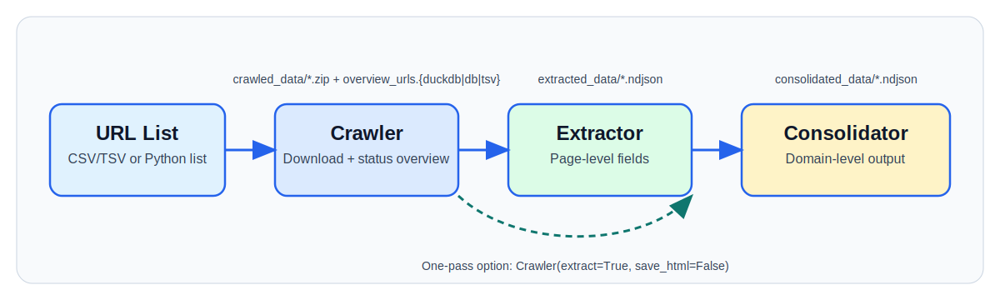

WebSweep Documentation
======================

WebSweep is a research-oriented scraping library for collecting text at scale
from many websites with a simple pipeline:

You can use WebSweep as either:

- a Python library (best for notebooks/custom research code), or
- a CLI (best for repeatable instance-based runs and periodic recrawls).

You can also run crawler + extractor in one pass to save disk space:
``Crawler(extract=True, save_html=False)``.

What each step does:

- ``Crawler``:
  starts from base URLs (one domain per row), downloads pages, follows only
  within-domain links, applies URL/file filtering rules, and stops at depth
  ``max_level`` (default ``3``).
  Input: URL list + crawl settings.
  Output: ``crawled_data/*.zip`` + ``overview_urls.{duckdb|db|tsv}``.
  For filter behavior, see :ref:`url-filtering-rules`.

- ``Extractor``:
  reads successful crawled pages and turns each page into one structured row.
  It extracts cleaned text (``text``), metadata (``meta_*``), and location
  fields (``zipcode``, ``address``), plus optional add-on fields.
  Input: overview + crawled zips.
  Output: ``extracted_data/*.ndjson``.

- ``Consolidator``:
  merges page-level rows into one row per domain for analysis-ready outputs.
  It keeps concatenated domain text and grouped domain-level fields (for
  example postcode/address frequencies).
  Input: ``extracted_data/*.ndjson``.
  Output: ``consolidated_data/*.ndjson``.

Quick links
-----------

- PyPI: https://pypi.org/project/websweep/
- Source: https://github.com/sodascience/websweep
- Issues: https://github.com/sodascience/websweep/issues
- Featured example notebook:
  https://github.com/sodascience/websweep/blob/main/examples/example_scraper_extractor.ipynb

Real-world use cases
--------------------

- Track climate-related language on corporate websites.
- Build collaboration networks from university and lab websites.
- Monitor public-health communication from official web sources.

Documentation map
-----------------

.. toctree::
   :maxdepth: 2

   installation
   userguide
   examples
   modules
   contribute
   contact
